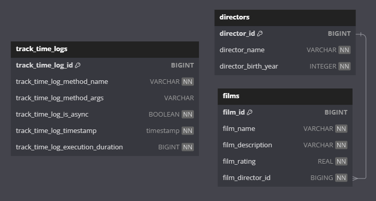

## Общее описание

Реализация системы учета времени выполнения методов с использованием Spring AOP.

- В качестве демо данных в приложении реализованы CRUD методы для работы с сущностями Film и Director
- Реализованы аннотации @TrackTime и @TrackAsyncTime для логирования времени выполнения методов над сущностями Film и Director
- Реализован сервис TrackTimeService с функцией асинхронного сохранения логов о времени работы методов
- Реализованы эндпоинты для запроса информации о времени выполнения методов над Film и Director

Принцип работы реализованных аспектов:
- @TrackTime - оборачивает метод, сохраняет время до вызова метода, получает время после выполнения метода и считает разницу
- @TrackAsyncTime - аналогично с @TrackTime, но вызов оборачиваемого метода происходит асинхронно через ComputableFuture

Оба реализованных аспекта сохраняют измеренное время выполнения отмеченного метода через асинхронный метод TrackTimeService с указанием длительности работы метода, имени метода и класса, в котором он был вызван.

## API
[Спецификация OpenAPI](./api/api-docs.json)

При работающем приложении доступен Swagger: http://localhost:8080/swagger-ui/index.html

***

[Коллекция Postman](./api/AopDemo.postman_collection.json)

Коллекция Postman содержит папку Setup. Запросы из папки Setup создадут тестовый набор данных для дальнейшей работы.

Папка Detached содержит примеры запросов ко всем доступным эндпоинтам приложения, в том числе по логам времени выполнения методов.

## Запуск приложения
### Вариант 1 - Запуск приложения и базы данных в Docker контейнерах

Сборка приложения и запуск через docker:

```
./mvnw clean package
docker-compose up
```

Поднимаемые контейнеры:

```
aop-demo-app - Приложение - порты 8080:8080
aop-demo-db - База данных PostgreSQL - порты 8081:5432
```

***

### Вариант 2 - Запуск приложения через IDE и Docker контейнер с базой данных

Запуск контейнера с базой данных:

```
docker-compose -f docker-compose-db-only.yml up
```

Поднимаемые контейнеры:

```
aop-demo-db - База данных PostgreSQL - порты 8081:5432
```

Приложение можно запустить любым удобным способом, например из IDE.

***

Для удобства тестирования база данных очищается при каждом запуске приложения.

## Структура БД

<p align="center">
  
</p>

## Stack

- Java 17
- Spring Boot 3
- JUnit
- PostgreSQL
- Maven
- Docker